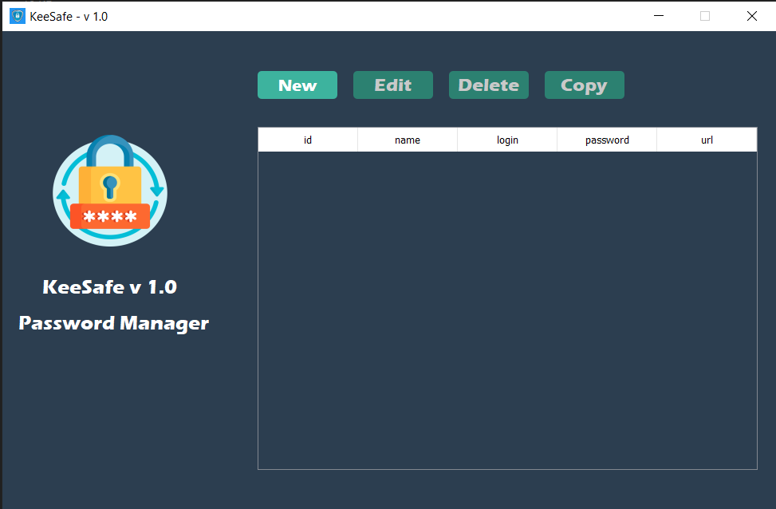

# Secure Password Manager with GUI
### This manager uses __rsa__ method of encrypting. Also it have comfortable interface.
___

## Setting
### First of all you must create a __masterkey__, which will __protect__ next login.

### Then you must choose place, where your __"private.pem"__ file will be saved. __It's very important file!__ Save it in safe place, for example on flash drive.
___
## Interface

___

## Buttons Panel
> __"New" button__ - add new data to manager.
> 
> 

> __"Edit button"__ - edit data in manager.
>
> 

> __"Delete"__ and __"Copy"__ buttons - to delete or copy data, enter name of data in column.
